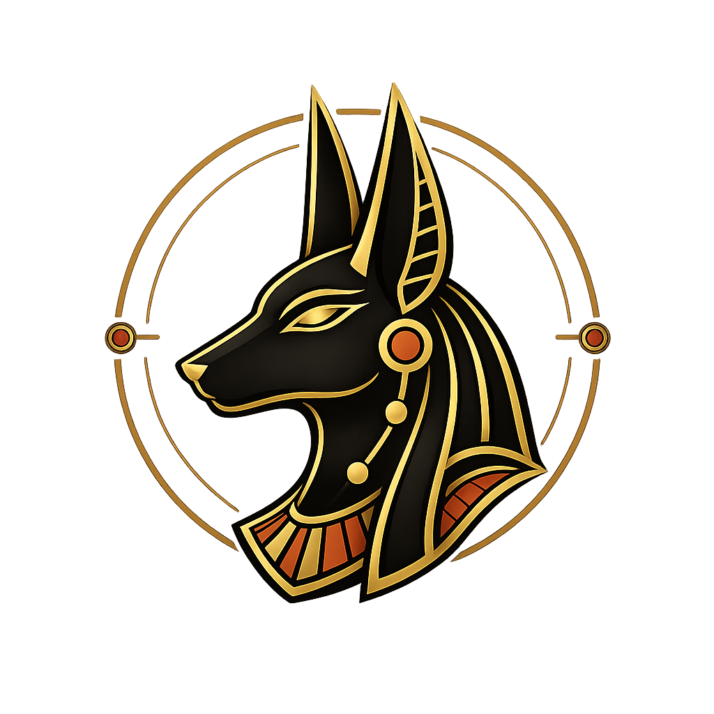

<p align="center">
  
</p>

<h1 align="center">
ANUBIS <br/>
Skeleton-Based Action Recognition Benchmark
</h1>


<p align="center">A comprehensive benchmark suite for skeleton-based action recognition algorithms</p>

<p align="center">
  <a href="https://arxiv.org/abs/2205.02071">📄 Paper</a> •
  <a href="https://yliu1082.github.io/ANUBIS/">🌐 Project Website</a> •
  <a href="https://huggingface.co/datasets/Khat865/Anubis-skeleton">📊 Dataset</a> •
  <a href="https://github.com/khat865/ANUBIS-Sourcecode">💻 Code</a>
</p>

---
A comprehensive benchmark suite for skeleton-based action recognition algorithms, featuring multiple state-of-the-art method implementations. This project aims to provide researchers with a unified evaluation platform for comparing different algorithms on skeleton-based action recognition tasks.

## ✨ Features

* 🔥 **15 State-of-the-Art Algorithms**: Integration of the most representative skeleton-based action recognition methods
* 📊 **Unified Evaluation Framework**: Standardized training, testing, and evaluation pipeline
* 🚀 **Efficient Implementation**: Optimized code implementations with GPU acceleration support
* 📈 **Comprehensive Benchmarking**: Support for multiple mainstream datasets
* 🛠️ **Easy to Use**: Detailed documentation and example code

## 🏗️ Project Structure

```bash
Anubis-benchmark/
├── 2s-AGCN/           
├── BlockGCN/          
├── CTR-GCN/          
├── Decoupling_GCN/     
├── DeGCN/            
├── GCN-NAS/          
├── HDGCN/           
├── Hyperformer/     
├── InfoGCN/          
├── LAGCN/            
├── Motif-stgcn/      
├── MS-G3D/           
├── ShiftGCN/         
├── STGCN/
├── STTFormer/                
├── requirements.txt 
└── README.md        
```

## 🛠️ Requirements

### System Requirements

* **Operating System**: Linux (recommended), Windows, macOS
* **Python**: 3.6 or higher
* **CUDA**: 10.2 or higher (recommended for GPU acceleration)

## 🚀 Quick Start

### 1. Clone Repository

```bash
git clone https://github.com/your-username/Anubis-benchmark.git
cd Anubis-benchmark
```

### 2. Create Virtual Environment (Recommended)

```bash
# Using conda
conda create -n anubis python=3.9
conda activate anubis

# Or using virtualenv
python -m venv anubis_env
source anubis_env/bin/activate  # Linux/macOS
# or anubis_env\Scripts\activate  # Windows
```

### 3. Install Dependencies

```bash
pip install -r requirements.txt
```

### 4. Data Preparation

Download and process **Anubis dataset**, available at:
👉 [HuggingFace Dataset Link](https://huggingface.co/datasets/Khat865/Anubis-skeleton) 

If you use our dataset, please cite our paper in your work.

### 5. Run Example

```bash
# Using DeGCN as an example
cd DeGCN
python main.py --config ./config/anubis/anubis.yaml
```

## 🔧 Usage Guide

### Custom Dataset

To use a custom dataset, you need to:

1. Implement data feeder (`feeders/`)
2. Define graph structure (`graph/`)
3. Update configuration files

## 📚 Citation

If you find this benchmark or dataset useful in your research, please consider citing:

```bibtex
@article{liu2026PR,
      title={Representation-Centric Survey of Supervised Skeletal Action Recognition and the New Benchmark}, 
      author={Yang Liu and Jiyao Yang and Madhawa Perera and Pan Ji and Dongwoo Kim and Min Xu and Tianyang Wang and Saeed Anwar and Tom Gedeon and Lei Wang and Zhenyue Qin},
      journal={Pattern Recognition},
      year={2026},
}
```

## 🙏 Acknowledgments

Thanks to all original paper authors for their outstanding contributions to skeleton-based action recognition.

---

<p align="center">⭐ If you like this project, please give it a star!</p>
